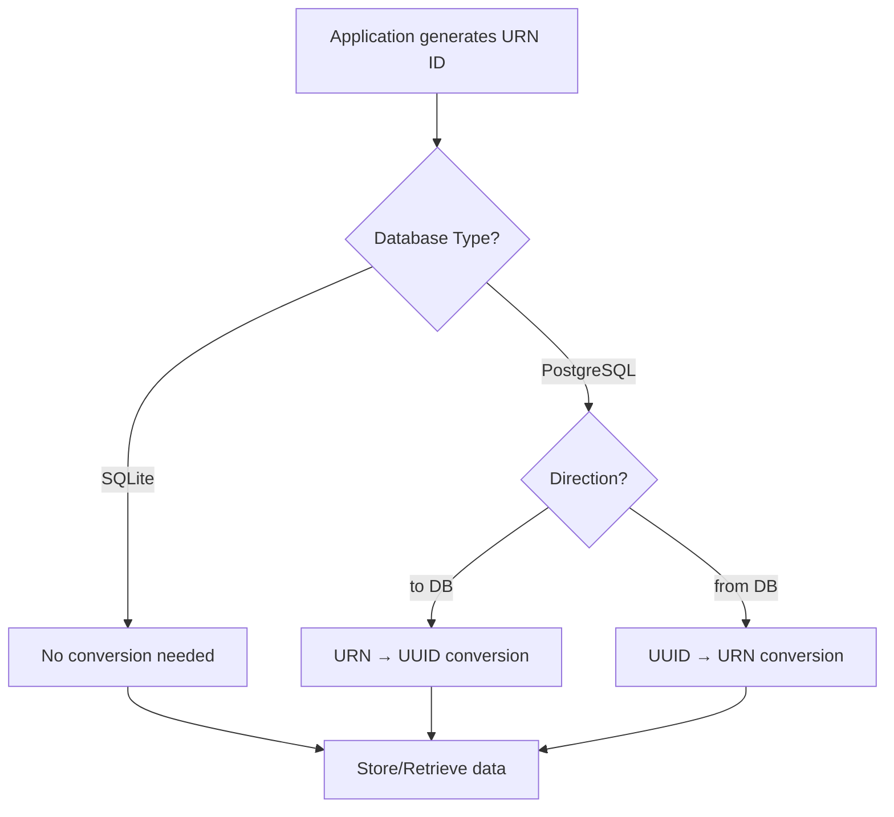

# UUID Conversion and Data Format Guide

This document explains the UUID conversion system and data format differences between SQLite and PostgreSQL in the OpenBadges Modular Server, essential for understanding data consistency and troubleshooting format issues.

## Table of Contents

1. [Overview](#overview)
2. [Data Format Differences](#data-format-differences)
3. [UUID Conversion System](#uuid-conversion-system)
4. [Implementation Details](#implementation-details)
5. [Migration Considerations](#migration-considerations)
6. [Troubleshooting](#troubleshooting)
7. [Best Practices](#best-practices)

## Overview

The OpenBadges Modular Server handles a critical data format challenge: **PostgreSQL requires plain UUID format while the application generates URN format identifiers**. The system implements sophisticated conversion utilities to maintain data consistency across database types.

### The Challenge

- **Application Layer**: Generates URN format IDs (`urn:uuid:550e8400-e29b-41d4-a716-446655440000`)
- **SQLite**: Accepts any string format (stores as text)
- **PostgreSQL**: Requires plain UUID format (`550e8400-e29b-41d4-a716-446655440000`)

### The Solution

Automatic bidirectional conversion between URN and UUID formats based on database type and operation direction.

## Data Format Differences

### SQLite Data Formats

```typescript
// Schema Definition
export const issuers = sqliteTable('issuers', {
  id: text('id').primaryKey(),           // Stores as text
  metadata: text('metadata'),            // JSON as text
  createdAt: integer('created_at'),      // Timestamps as integers
});

// Data Storage Examples
{
  id: "urn:uuid:550e8400-e29b-41d4-a716-446655440000",  // URN format
  metadata: '{"key": "value"}',                          // JSON as string
  createdAt: 1640995200000                               // Epoch milliseconds
}
```

### PostgreSQL Data Formats

```typescript
// Schema Definition
export const issuers = pgTable('issuers', {
  id: uuid('id').primaryKey().defaultRandom(),    // Native UUID type
  metadata: jsonb('metadata'),                    // Native JSONB
  createdAt: timestamp('created_at').defaultNow() // Native timestamp
});

// Data Storage Examples
{
  id: "550e8400-e29b-41d4-a716-446655440000",     // Plain UUID
  metadata: {"key": "value"},                      // Native JSON object
  createdAt: "2022-01-01T00:00:00.000Z"          // ISO timestamp
}
```

### Key Differences Summary

| Aspect | SQLite | PostgreSQL |
|--------|--------|------------|
| **ID Format** | URN (`urn:uuid:...`) | Plain UUID (`...`) |
| **JSON Storage** | Text string | Native JSONB |
| **Timestamps** | Integer (epoch ms) | Native timestamp |
| **Type Safety** | String-based | Native types |
| **Performance** | Text operations | Optimized native ops |

## UUID Conversion System

### Core Conversion Functions

Located in `src/infrastructure/database/utils/type-conversion.ts`:

```typescript
/**
 * Main conversion function - handles database-specific UUID conversion
 */
export function convertUuid(
  value: string | null | undefined,
  dbType: 'postgresql' | 'sqlite',
  direction: 'to' | 'from'
): string | null | undefined

/**
 * Converts URN format to plain UUID
 * "urn:uuid:550e8400-..." → "550e8400-..."
 */
export function urnToUuid(urn: string): string

/**
 * Converts plain UUID to URN format  
 * "550e8400-..." → "urn:uuid:550e8400-..."
 */
export function uuidToUrn(uuid: string): string

/**
 * Validates UUID format (plain UUID only)
 */
export function isValidUuid(value: string): boolean
```

### Conversion Logic Flow



### Usage Examples

```typescript
// Application to Database (direction: 'to')
const appId = "urn:uuid:550e8400-e29b-41d4-a716-446655440000";

// SQLite - no conversion
const sqliteId = convertUuid(appId, 'sqlite', 'to');
// Result: "urn:uuid:550e8400-e29b-41d4-a716-446655440000"

// PostgreSQL - URN to UUID
const pgId = convertUuid(appId, 'postgresql', 'to');
// Result: "550e8400-e29b-41d4-a716-446655440000"

// Database to Application (direction: 'from')
const dbUuid = "550e8400-e29b-41d4-a716-446655440000";

// PostgreSQL - UUID to URN
const appResult = convertUuid(dbUuid, 'postgresql', 'from');
// Result: "urn:uuid:550e8400-e29b-41d4-a716-446655440000"
```

## Implementation Details

### Repository Integration

Each PostgreSQL repository uses conversion in mappers:

```typescript
// PostgreSQL Issuer Mapper Example
export class PostgresIssuerMapper {
  toPersistence(entity: Issuer): PostgresIssuerRecord {
    return {
      // Convert URN to UUID for PostgreSQL storage
      id: convertUuid(entity.id, 'postgresql', 'to') as string,
      name: entity.name,
      // ... other fields
    };
  }

  toDomain(record: PostgresIssuerRecord): Issuer {
    return Issuer.create({
      // Convert UUID back to URN for application
      id: convertUuid(record.id, 'postgresql', 'from') as Shared.IRI,
      name: record.name,
      // ... other fields
    });
  }
}
```

### SQLite Implementation

SQLite repositories require no conversion:

```typescript
// SQLite Issuer Mapper Example
export class SqliteIssuerMapper {
  toPersistence(entity: Issuer): SqliteIssuerRecord {
    return {
      // No conversion needed - SQLite accepts URN format
      id: entity.id,
      name: entity.name,
      // ... other fields
    };
  }

  toDomain(record: SqliteIssuerRecord): Issuer {
    return Issuer.create({
      // No conversion needed
      id: record.id as Shared.IRI,
      name: record.name,
      // ... other fields
    });
  }
}
```

### Error Handling

The conversion system includes comprehensive error handling:

```typescript
// Invalid UUID format handling
export function urnToUuid(urn: string): string {
  if (urn.startsWith('urn:uuid:')) {
    const uuid = urn.substring(9);
    if (isValidUuid(uuid)) {
      return uuid;
    } else {
      logger.warn('Invalid UUID extracted from URN', { urn, extractedUuid: uuid });
      return urn; // Return original if extraction failed
    }
  }
  
  // Handle non-URN format
  if (isValidUuid(urn)) {
    return urn; // Already plain UUID
  }
  
  logger.warn('Value is neither valid URN nor UUID format', { value: urn });
  return urn; // Return original with warning
}
```

## Migration Considerations

### Database Switching

When switching between database types:

1. **SQLite → PostgreSQL**: URN format IDs are automatically converted to UUID format
2. **PostgreSQL → SQLite**: UUID format IDs are automatically converted to URN format
3. **Data integrity**: Conversion is bidirectional and lossless

### Schema Migration

```sql
-- PostgreSQL schema expects UUID format
CREATE TABLE issuers (
  id UUID PRIMARY KEY DEFAULT gen_random_uuid(),
  -- ...
);

-- SQLite schema accepts any text format
CREATE TABLE issuers (
  id TEXT PRIMARY KEY,
  -- ...
);
```

### Data Export/Import

```typescript
// Export from PostgreSQL (UUID) to SQLite (URN)
const exportedData = postgresRecords.map(record => ({
  ...record,
  id: uuidToUrn(record.id), // Convert to URN for SQLite
}));

// Import from SQLite (URN) to PostgreSQL (UUID)
const importedData = sqliteRecords.map(record => ({
  ...record,
  id: urnToUuid(record.id), // Convert to UUID for PostgreSQL
}));
```

## Troubleshooting

### Common Issues

#### 1. PostgreSQL UUID Format Error

```
PostgresError: invalid input syntax for type uuid: "urn:uuid:..."
```

**Cause**: URN format ID passed directly to PostgreSQL without conversion
**Solution**: Ensure mapper uses `convertUuid()` with direction 'to'

#### 2. Application Receives Plain UUID

```
Error: Expected URN format but received plain UUID
```

**Cause**: PostgreSQL UUID not converted back to URN format
**Solution**: Ensure mapper uses `convertUuid()` with direction 'from'

#### 3. Invalid UUID Format

```
Warning: Value is neither valid URN nor UUID format
```

**Cause**: Malformed ID that doesn't match expected patterns
**Solution**: Validate ID generation and check for data corruption

### Debugging Tools

```typescript
// Enable detailed UUID conversion logging
process.env.LOG_LEVEL = 'debug';

// Test conversion functions
import { convertUuid, urnToUuid, uuidToUrn, isValidUuid } from '@/infrastructure/database/utils/type-conversion';

// Validate UUID format
console.log(isValidUuid('550e8400-e29b-41d4-a716-446655440000')); // true
console.log(isValidUuid('urn:uuid:550e8400-e29b-41d4-a716-446655440000')); // false

// Test conversions
const urn = 'urn:uuid:550e8400-e29b-41d4-a716-446655440000';
const uuid = urnToUuid(urn);
const backToUrn = uuidToUrn(uuid);
console.log({ urn, uuid, backToUrn });
```

## Best Practices

### 1. Always Use Conversion Functions

```typescript
// ✅ Correct - use conversion utilities
const dbId = convertUuid(entity.id, dbType, 'to');

// ❌ Incorrect - direct assignment
const dbId = entity.id; // May cause format mismatch
```

### 2. Validate Conversion Results

```typescript
// ✅ Correct - validate after conversion
const uuid = urnToUuid(urnId);
if (!isValidUuid(uuid)) {
  throw new Error(`Invalid UUID after conversion: ${uuid}`);
}
```

### 3. Handle Edge Cases

```typescript
// ✅ Correct - handle null/undefined
const converted = convertUuid(value, dbType, direction);
if (converted === null || converted === undefined) {
  // Handle appropriately
}
```

### 4. Use Type-Safe Patterns

```typescript
// ✅ Correct - maintain type safety
const id: Shared.IRI = convertUuid(dbId, 'postgresql', 'from') as Shared.IRI;

// ❌ Incorrect - lose type information
const id = convertUuid(dbId, 'postgresql', 'from');
```

---

**Related Documentation:**
- [Database Architecture Overview](./database-architecture-overview.md) - Complete system architecture
- [Repository Implementation Guide](./repository-implementation-guide.md) - Implementing custom repositories
- [Database Connection Guide](./database-connection-guide.md) - Connection setup and configuration
